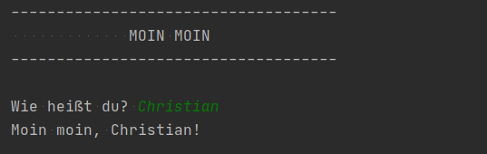

# Projekt 1: Moin Moin, Welt!

So soll das fertige Programm aussehen:

Der **weiße** Text ist die Ausgabe des Programms. Der **grüne** Text wird vom Benutzer eingegeben. Schreibe dein Programm in die Datei `program.py`

Das könnte dir helfen:
-------------------

* `print('text')`
* `text = input('Frage an den Benutzer')`
*  Um Texte und Variablen zusammenzufügen benötigst du sogenannte f-strings: `print(f'Text hier {Variablenname} text geht weiter.')`

Hinweis: Es geht nicht (nur) darum, die ersten Funktionen der Sprache zu lernen. Die erste Aufgabe ist vor allem ein Test, ob alles richtig installiert ist und läuft: Python 3, PyCharm und git.

Quelle
------
Die Übungsaufgaben basieren auf [cmacht/python-grundlagen](https://github.com/cmacht/python-grundlagen) und dem englischen Original von Michael Kennedy auf [TalkPython Training](https://training.talkpython.fm/courses/explore_python_jumpstart/python-language-jumpstart-building-10-apps).
